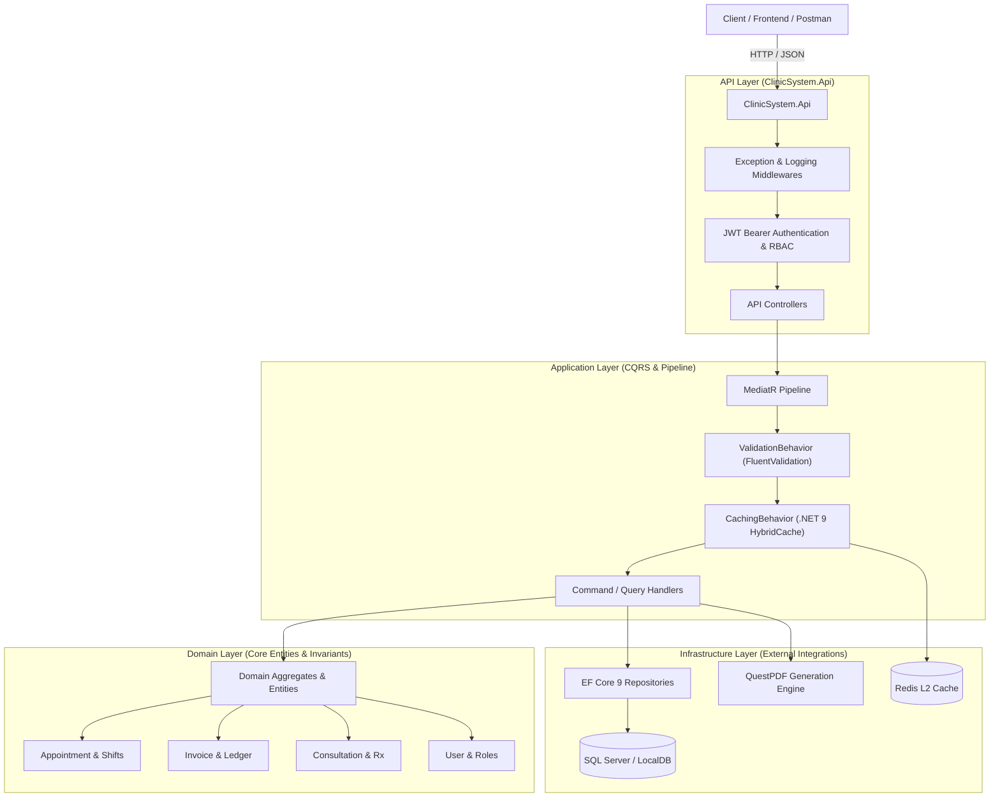

<div align="center">

# 🏥 Clinic Management System (Enterprise Backend)

**A high-performance, modular, and enterprise-grade Clinic Management System built with .NET 9, Clean Architecture, CQRS (MediatR), HybridCache, QuestPDF, and JWT Role-Based Access Control.**

[](https://dotnet.microsoft.com/)
[](https://learn.microsoft.com/en-us/dotnet/csharp/)
[](https://learn.microsoft.com/en-us/ef/core/)
[](https://github.com/jbogard/MediatR)
[](https://scalar.com/)
[](https://www.questpdf.com/)
[-success?style=for-the-badge&logo=githubactions&logoColor=white)](#-automated-testing)
[](LICENSE)

[Architecture](DOCUMENTATION.md) • [API Guide & Reference](API_DOCUMENTATION.md) • [Interactive Scalar Docs](https://localhost:7198/scalar/v1) • [Getting Started](#-getting-started)

</div>

---

## 📑 Table of Contents
- [✨ Key Features](#-key-features)
- [🏛 Architecture Overview](#-architecture-overview)
- [📁 Project Structure](#-project-structure)
- [🚀 Getting Started](#-getting-started)
- [🔐 Security & Seeded Accounts](#-security--seeded-accounts)
- [📊 API Reference](#-api-reference)
- [📄 PDF Generation Engine](#-pdf-generation-engine)
- [🧪 Automated Testing](#-automated-testing)
- [📜 License](#-license)

---

## ✨ Key Features

* **🏛 Clean Architecture & CQRS**: Strict domain decoupling using Commands & Queries orchestrated through MediatR pipeline behaviors.
* **🛡 Automatic Validation Pipeline**: Integrated FluentValidation behavior that halts invalid requests and returns RFC 7807 ProblemDetails.
* **⚡ Multi-Tier Hybrid Caching**: Leverages .NET 9 `HybridCache` (L1 In-Memory + L2 Redis backing) with stampede protection and automated tag invalidation.
* **📅 Conflict-Free Slot & Queue Engine**: Configurable doctor working shifts, dynamic available slot computations, and double-booking conflict prevention.
* **📊 Real-Time Analytics Dashboard**: Instant operational insights including today's appointment statuses, live queue volumes, revenue metrics, and top utilized services.
* **📄 Automated PDF Document Generation**: High-performance in-memory PDF rendering via `QuestPDF` for official invoice receipts and medical prescription sheets.
* **🔐 JWT Authentication & RBAC**: Secure BCrypt password hashing, access/refresh token rotation, and Role-Based Access Control (`Admin`, `Doctor`, `Receptionist`, `Cashier`, `Patient`).
* **♻️ Auditing & Soft Deletion**: Global query filters (`!e.IsDeleted`) and automatic timestamp auditing (`CreatedAtUtc`, `LastModifiedAtUtc`, `DeletedAtUtc`).
* **📖 Interactive API Documentation**: Integrated [Scalar](https://scalar.com/) OpenAPI 3.0 documentation with interactive Bearer authorization.

---

## 🏛 Architecture Overview



---

## 📁 Project Structure

```bash
ClinicSystem/
├── ClinicSystem.Domain/               # Core domain entities, aggregates, value objects, and events
│   ├── Appointments/                 # Appointment aggregate, AppointmentStatus, AppointmentType
│   ├── Billing/                      # Invoice, InvoiceItem, PaymentMethod, InvoiceStatus
│   ├── Common/                       # BaseEntity, ISoftDeletable, ValueObject
│   ├── Doctors/                      # Doctor aggregate, DoctorWorkingSchedule, Specialization
│   ├── MedicalRecords/               # ConsultationRecord, PrescriptionItem
│   ├── Patients/                     # Patient aggregate, PatientContactInfo
│   └── Users/                        # User aggregate, Security Roles
│
├── ClinicSystem.Application/          # CQRS orchestrations, commands, queries, and validators
│   ├── Analytics/                    # Dashboard summary queries and analytics DTOs
│   ├── Appointments/                 # Book, Update Status, Available Slots queries
│   ├── Auth/                         # Register, Login, Refresh Token handlers
│   ├── Billing/                      # Invoicing, Payment recording, PDF Invoice query
│   ├── Common/                       # Pipeline behaviors (Validation, Caching, Invalidation)
│   ├── Doctors/                      # Doctor management commands & queries
│   ├── MedicalRecords/               # Consultation records & Prescription PDF queries
│   ├── Patients/                     # Patient registration and profile queries
│   └── Services/                     # Medical service catalog commands & queries
│
├── ClinicSystem.Infrastructure/       # Database persistence, caching, security, and PDF generation
│   ├── Persistence/                  # ApplicationDbContext, EF Configurations, Migrations, Seeder
│   ├── Repositories/                 # Repository implementations (Patient, Doctor, Invoice, etc.)
│   └── Services/                     # PdfReportService (QuestPDF), PasswordHasher, JwtTokenGenerator
│
├── ClinicSystem.Api/                  # RESTful API endpoints and ASP.NET Core hosting
│   ├── Controllers/                  # Auth, Dashboard, Appointments, Doctors, Invoices, Consultations
│   ├── Middlewares/                  # ProblemDetails ExceptionHandling & RequestLogging
│   ├── ClinicSystem.Api.http         # Ready-to-run HTTP requests test suite
│   └── Program.cs                    # Application bootstrapping and middleware pipeline
│
├── ClinicSystem.UnitTests/            # 17 Unit Tests (xUnit, FluentAssertions, Moq)
└── ClinicSystem.IntegrationTests/     # 5 End-to-End Integration Tests (WebApplicationFactory)
```

---

## 🚀 Getting Started

### Prerequisites
* [.NET 9.0 SDK](https://dotnet.microsoft.com/download/dotnet/9.0) or higher
* [SQL Server](https://www.microsoft.com/sql-server) (LocalDB / Express / Enterprise)
* *(Optional)* [Redis](https://redis.io/) for distributed caching (In-Memory fallback active by default)

### Installation & Run

1. **Clone the repository**:
   ```bash
   git clone https://github.com/tuhazem/ClinicSystem.git
   cd ClinicSystem
   ```

2. **Restore dependencies**:
   ```bash
   dotnet restore
   ```

3. **Build the solution**:
   ```bash
   dotnet build
   ```

4. **Launch the API**:
   ```bash
   dotnet run --project ClinicSystem.Api
   ```

5. **Access Interactive Documentation**:
   Navigate to `https://localhost:7198/scalar/v1` in your browser.

---

## 🔐 Security & Seeded Accounts

The database is automatically seeded upon initial startup with pre-configured staff and patient accounts:

| Username | Password | Role | Access Scope |
| :--- | :--- | :--- | :--- |
| **`admin`** | `Admin@123` | `Admin` | Full clinic administrative privileges |
| **`dr.house`** | `Doctor@123` | `Doctor` | Clinical diagnoses, prescriptions, schedule access |
| **`receptionist`** | `Staff@123` | `Receptionist` | Patient registration, appointment bookings, queue caller |
| **`cashier`** | `Cashier@123` | `Cashier` | Invoice issuance, payment recording, receipt generation |
| **`patient.jvance`** | `Patient@123` | `Patient` | Personal medical records, appointment history |

---

## 📊 API Reference

| Module | Method | Endpoint | Description | Auth |
| :--- | :---: | :--- | :--- | :---: |
| **Auth** | `POST` | `/api/auth/login` | Authenticate user & receive JWT tokens | Public |
| **Auth** | `POST` | `/api/auth/register` | Register new user with assigned role | Public |
| **Auth** | `POST` | `/api/auth/refresh` | Refresh expired access token | Public |
| **Auth** | `GET` | `/api/auth/me` | Retrieve authenticated user profile | Bearer |
| **Dashboard** | `GET` | `/api/dashboard/summary` | Real-time operational & revenue metrics | Public / Staff |
| **Patients** | `POST` | `/api/patients` | Register a new patient | Receptionist / Admin |
| **Patients** | `GET` | `/api/patients/{id}` | Retrieve patient profile (Cached) | Staff |
| **Doctors** | `POST` | `/api/doctors` | Register doctor & default schedule | Admin |
| **Doctors** | `GET` | `/api/doctors` | List all active doctors (Cached) | Public |
| **Doctors** | `GET` | `/api/doctors/{id}` | Retrieve doctor details (Cached) | Public |
| **Appointments**| `POST` | `/api/appointments/book` | Book appointment (Conflict-free check) | Receptionist / Patient |
| **Appointments**| `GET` | `/api/appointments/doctor/{id}/available-slots` | Dynamic available booking slots | Public |
| **Appointments**| `GET` | `/api/appointments/doctor/{id}` | Doctor queue & daily schedule | Staff |
| **Appointments**| `PATCH`| `/api/appointments/{id}/status` | Update status (Confirm/Start/Complete/Cancel) | Staff |
| **Consultations**| `POST`| `/api/consultations` | Record diagnosis & prescriptions (Rx) | Doctor |
| **Consultations**| `GET` | `/api/consultations/patient/{id}` | Patient electronic medical history | Doctor / Patient |
| **Consultations**| `GET` | `/api/consultations/{id}/pdf` | Stream official printable Prescription PDF | Doctor / Patient |
| **Invoices** | `POST` | `/api/invoices` | Create & issue itemized patient invoice | Cashier / Receptionist |
| **Invoices** | `GET` | `/api/invoices/patient/{id}` | Retrieve patient invoice history | Cashier / Patient |
| **Invoices** | `POST` | `/api/invoices/{id}/pay` | Record invoice payment (Cash/Card/Insurance) | Cashier |
| **Invoices** | `GET` | `/api/invoices/{id}/pdf` | Download official Invoice PDF Receipt | Cashier / Patient |
| **Services** | `POST` | `/api/services` | Add service to clinic medical catalog | Admin |
| **Services** | `GET` | `/api/services` | List all available medical services | Public |

---

## 📄 PDF Generation Engine

The system features native in-memory PDF generation built on **QuestPDF**:
* **🧾 Invoices & Receipts**: Generates clean, branded receipts complete with clinic header, patient details, breakdown of itemized procedures, subtotal, payments, and outstanding balance status stamps.
* **💊 Medical Prescriptions (Rx)**: Generates clinical encounter summaries including presenting symptoms, primary diagnosis, structured prescription medications (Dosage, Frequency, Duration, Instructions), and attending doctor signature credentials.

---

## 🧪 Automated Testing

The solution is covered by a suite of **22 automated tests** verifying business logic invariants, MediatR pipeline behaviors, and end-to-end API integration flows.

```powershell
# Run the entire test suite
dotnet test ClinicSystem.sln
```

### Test Results Breakdown
* **`ClinicSystem.UnitTests`** (17 tests):
  * Aggregate state machines and lifecycle validations (`AppointmentTests`, `InvoiceTests`, `DoctorTests`).
  * MediatR `ValidationBehavior` interception and error formatting (`ValidationBehaviorTests`).
  * Command handler business rules and mock repository validations (`BookAppointmentCommandHandlerTests`, `RecordPaymentCommandHandlerTests`).
* **`ClinicSystem.IntegrationTests`** (5 tests):
  * End-to-end user registration and JWT authentication flow.
  * Real-time dashboard summary metrics aggregation.
  * Conflict-free doctor available slots calculation.
  * Invoice PDF binary stream generation and `%PDF` signature verification.
  * Prescription PDF binary stream generation and `%PDF` signature verification.

---

## 📜 License

This project is licensed under the MIT License. See the [LICENSE](LICENSE) file for details.
